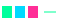
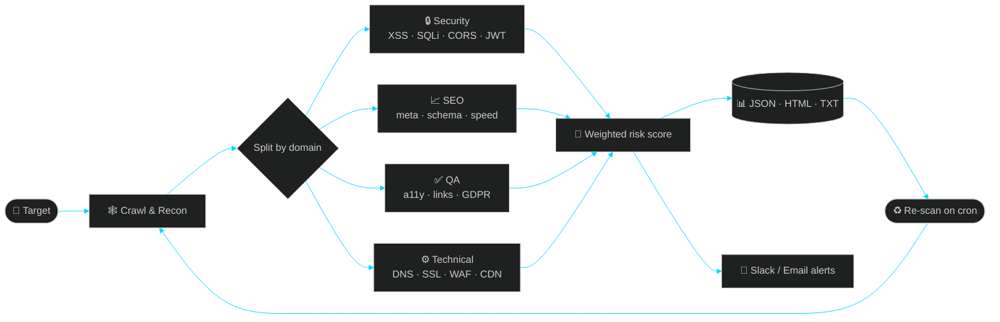
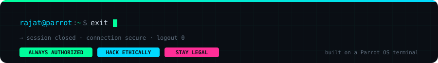

<p align="center">
  
</p>

<p align="center">
  
</p>

<p align="center">
  <a href="https://qmlab-indol.vercel.app/"></a>
  <a href="https://linkedin.com/in/rajat-kumar-dash"></a>
  <a href="https://twitter.com/qm_rajat_"></a>
  <a href="mailto:rajatkudash.2004@gmail.com"></a>
</p>

<p align="center">
  
  
  
</p>


##  &nbsp;whoami

```python
class Rajat_Kumar_Dash:
    def __init__(self):
        self.roles      = ["Technical SEO", "Python Developer", "Web Developer",
                           "Data Scientist", "API Tester"]
        self.daily_os   = ["Parrot OS", "Ubuntu", "Window 11"]
        self.focus      = "auditing, breaking, and automating the web"
        self.philosophy = "I don't just code — I map how systems actually behave"

    def current_work(self) -> list[str]:
        return [
            "Shipping PentestSEO — 39-module security + SEO audit framework",
            "Building full-stack products on Next.js 14 + Supabase",
            "Designing scalable Selenium/PyTest automation suites",
        ]
```


##  &nbsp;how I actually work




##  &nbsp;arsenal

<table>
<tr><td width="150"><b>🔎 SEO</b></td><td>


</td></tr>

<tr><td><b>🐍 Python</b></td><td>


</td></tr>

<tr><td><b>🌐 Web</b></td><td>

</td></tr>

<tr><td><b>📊 Data</b></td><td>


</td></tr>

<tr><td><b>🛡️ Security</b></td><td>


</td></tr>

<tr><td><b>⚙️ Infra</b></td><td>

</td></tr>
</table>


##  &nbsp;featured builds

<p align="center">
  <a href="https://github.com/qm-rajat/PentestSEO"></a>
  <a href="https://github.com/qm-rajat/tableserve"></a>
</p>
<p align="center">
  <a href="https://github.com/qm-rajat/Dash_Poultry"></a>
  <a href="https://github.com/qm-rajat/saucedemo-automation"></a>
</p>
<p align="center">
  <a href="https://github.com/qm-rajat/qmlab"></a>
  <a href="https://qmlab-indol.vercel.app"></a>
</p>

<sub>↑ every card links to its repo · <a href="https://tableserve-bice.vercel.app">TableServe live demo</a></sub>


##  &nbsp;telemetry

<p align="center">
  
  
</p>

<p align="center">
  
</p>

<p align="center">
  
</p>

<p align="center">
  
</p>


##  &nbsp;contribution snake

<p align="center">
  <picture>
    <source media="(prefers-color-scheme: dark)" srcset="https://raw.githubusercontent.com/qm-rajat/qm-rajat/output/snake-dark.svg"/>
    <source media="(prefers-color-scheme: light)" srcset="https://raw.githubusercontent.com/qm-rajat/qm-rajat/output/snake.svg"/>
    
  </picture>
</p>


##  &nbsp;deep metrics <sub>(auto-refreshed every 12h)</sub>

<p align="center">
  
  
</p>
<p align="center">
  
  
</p>


##  &nbsp;live activity

<!--START_SECTION:activity-->
<!--END_SECTION:activity-->

---

<details>
<summary><b>🎯 Roadmap 2026</b></summary>

<br/>

- [ ] Ship **PentestSEO v2** — async scan engine, plugin API, Docker image
- [ ] Publish a Python package to PyPI with full CI/CD
- [ ] Land a CVE or a meaningful bug-bounty finding
- [ ] Grow **qmlab** into a public SEO/security tooling suite
- [ ] Consistent open-source contribution streak
- [ ] Ship one production data-science project end to end

</details>

<details>
<summary><b>🔐 Secret channel</b></summary>

<br/>

```
$ echo "You're not browsing. You're reconning." | base64
WW91J3JlIG5vdCBicm93c2luZy4gWW91J3JlIHJlY29ubmluZy4K
```

Stay curious. Stay unstoppable. Always get written authorization. ⚡

</details>

---

<p align="center">
  
</p>

<p align="center"><sub><code>rajat@parrot:~$ exit</code> — built with too much coffee and a Parrot OS terminal</sub></p>
